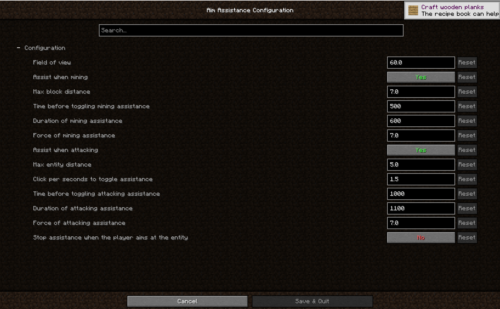

# AimAssistance

The only Minecraft Mod that helps to aim without giving an unfair PvP advantage. Useful for new players that are
not used to play on a computer. Everything is configurable. Ideal to introduce Minecraft to your parents!

_Fighting assistance (it does not work on other players)_

---

_Mining assistance_

---

_Configuration screen_
